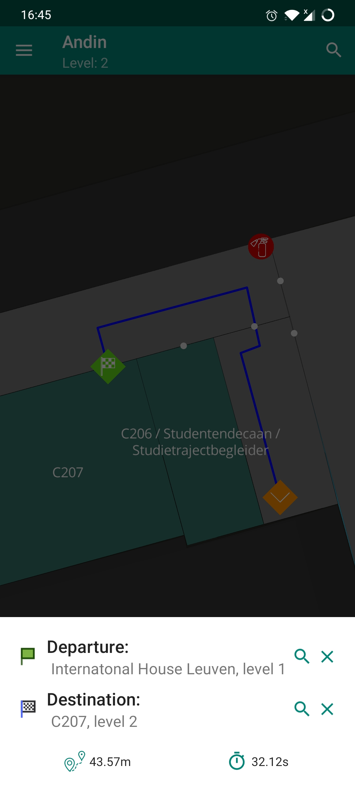

# Andin Android App

*Indoor building viewing & navigation*

Andin helps you navigate complicated buildings by providing a map of the building's floors, a 3D view of it's rooms, and interactive navigation directions.

## Screenshots

Screenshot 1             |  Screenshot 2
:-------------------------:|:-------------------------:
  |  

## Backend API

Managed in [github.com/ubipo/andin-api](https://github.com/ubipo/andin-api)

## Data processing and SQL migrations

Managed in [github.com/ubipo/andin-db](https://github.com/ubipo/andin-db)
